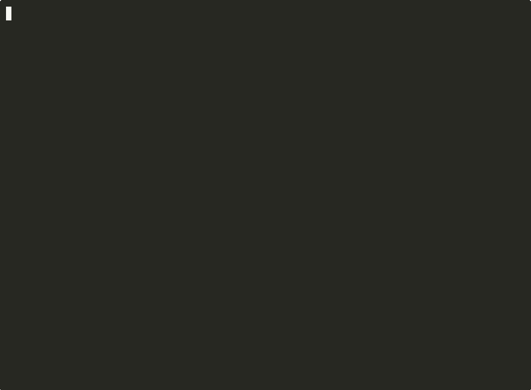

# nf — Note Fast


A minimal terminal note-taking tool for Linux and macOS.

Capture a command, a thought, or a snippet in one line. Find it later in seconds.
No cloud. No account. No setup. Just your terminal.

---

## Demo



<details>
<summary>Text version</summary>

```bash
$ nf "fuser -k 3000/tcp — kills process on port 3000"
Note saved.

$ nf search port
 1  2025-04-25  fuser -k 3000/tcp — kills process on port 3000

$ nf list
 1  2025-04-25  fuser -k 3000/tcp — kills process on port 3000
 2  2025-04-25  refactor auth module before friday
 3  2025-04-25  ssh-keygen -t ed25519 — generate modern ssh key

$ nf del 2
Deleted note 2.

$ nf count
2
```
</details>

---

## Install

**One-liner (universal):**

```bash
curl -sL https://nf.iamk.xyz/install | bash
```

Skip shell tab-completion setup:

```bash
curl -sL https://nf.iamk.xyz/install | bash -s -- --no-completion
```

**Homebrew (macOS / Linux):**

```bash
brew install KOUSTAV2409/tap/nf
```

**Arch Linux (AUR):** build from `PKGBUILD` in this repo (`makepkg -si`).

**Debian:** build a `.deb` with `./build_deb.sh`, then `sudo dpkg -i nf_*.deb`.

**Manual:**

```bash
git clone https://github.com/KOUSTAV2409/nf.git
cd nf
chmod +x nf.sh
sudo ln -s "$(pwd)/nf.sh" /usr/local/bin/nf
```

---

## Update

**Homebrew:**

```bash
brew upgrade KOUSTAV2409/tap/nf
```

**One-liner / manual install:**

```bash
nf update
```

**Arch / Debian:** rebuild and reinstall from the updated package in this repo.

---

## Usage

| Command | Description |
|---|---|
| `nf "text"` | Save a new note |
| `nf` | Open TUI (requires fzf) or list notes |
| `nf list` | List all notes |
| `nf search <term>` | Search notes (case-insensitive, plain text) |
| `nf find <term>` | Alias for search |
| `nf del <number>` | Delete a note by number |
| `nf export <n>` | Export one note to `note-<n>.txt` |
| `nf export <n> <n>...` | Export several notes (one file per number) |
| `nf export all` | Export entire notebook to `notes-YYYY-MM-DD.txt` |

Exports are saved to `~/Downloads/nfExports/` by default.
| `nf edit` | Interactive menu to manage notes |
| `nf count` | Show total number of notes |
| `nf update` | Download and install the latest version |
| `nf help` | Show help |
| `nf version` | Show version |

### Export notes

`nf list` numbers every note:

```bash
nf export 5        # → ~/Downloads/nfExports/note-5.txt
nf export 1 3 5    # → one file per number in that folder
nf export all      # → ~/Downloads/nfExports/notes-2026-06-05.txt
```

Custom export folder: `export NF_EXPORT_DIR=~/Documents/backups`

Guide: [nf.iamk.xyz/guides/export](https://nf.iamk.xyz/guides/export)

---

## TUI Mode

If [fzf](https://github.com/junegunn/fzf) is installed, running `nf` with no arguments opens an interactive fuzzy finder.

- **Enter** — copy selected note to clipboard
- **Ctrl-D** — delete selected note
- **Esc** — quit

fzf is optional. Without it, `nf` falls back to `nf list`.

```bash
# Install fzf
sudo apt install fzf        # Ubuntu/Debian
sudo pacman -S fzf           # Arch
sudo dnf install fzf         # Fedora
brew install fzf             # macOS (Homebrew)
```

---

## Notes are stored at

```
~/.local/share/nf/notes
```

It's a plain text file — one note per line, date-prefixed. You can read it with `cat`, search it with `grep`, back it up with `cp`, edit it with any text editor. No lock-in.

Use a different file path:

```bash
export NF_NOTES_FILE="$HOME/notes.txt"
nf "saved to a custom file"
```

```
2025-04-25 fuser -k 3000/tcp — kills process on port 3000
2025-04-25 ss -tulpn | grep LISTEN — shows all listening ports
```

---

## ⚡ Tab Completion (Optional)
Make `nf` even faster by adding auto-completion to your shell.

**For Bash**: Add this to your `~/.bashrc`:
```bash
source <(curl -sL https://nf.iamk.xyz/completions/nf.bash)
```

**For Zsh**: Add this to your `~/.zshrc`:
```zsh
source <(curl -sL https://nf.iamk.xyz/completions/nf.zsh)
```

The install script can set this up for you (you'll be asked first in an interactive terminal).

---

## 💎 Why nf?

- **Fast.** One command to save. One command to search. Under 3 seconds.
- **Local.** No cloud, no account, no internet required.
- **Plain text.** Your notes are a single readable file. grep it, cat it, back it up.
- **No setup.** Install and use immediately. No config, no init, no database.
- **Open source.** MIT licensed. Fork it, extend it, make it yours.

---

## Uninstall

```bash
curl -sL https://nf.iamk.xyz/uninstall | bash
```

Or manually:

```bash
sudo rm /usr/local/bin/nf
rm -rf ~/.local/share/nf  # optional: delete your notes
```

---

## Contributing

See [CONTRIBUTING.md](CONTRIBUTING.md).

---

## License

[MIT](LICENSE)
